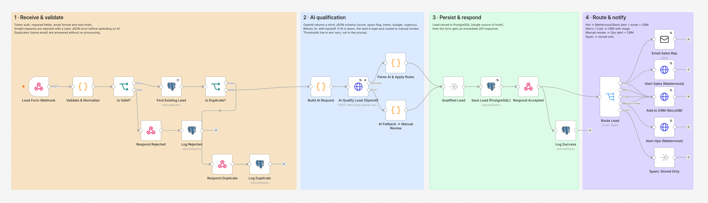
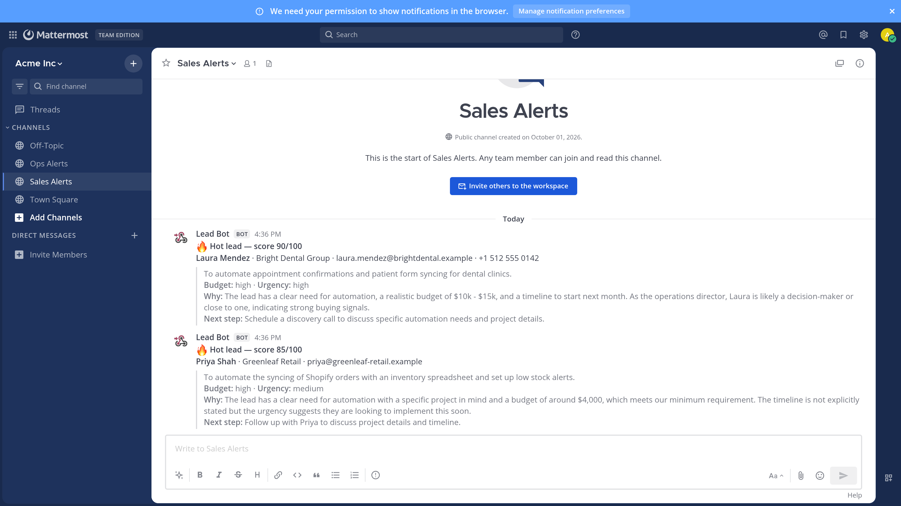
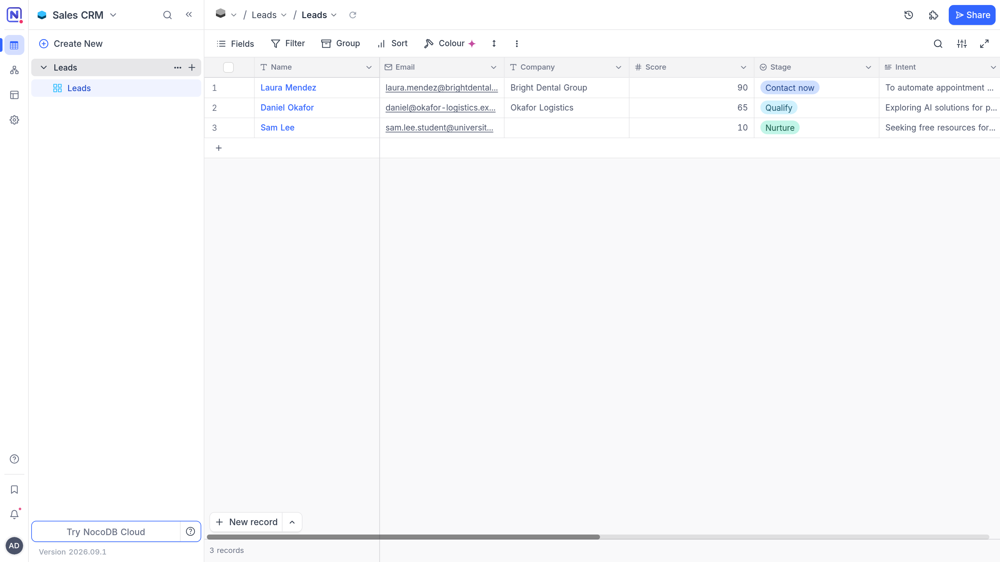
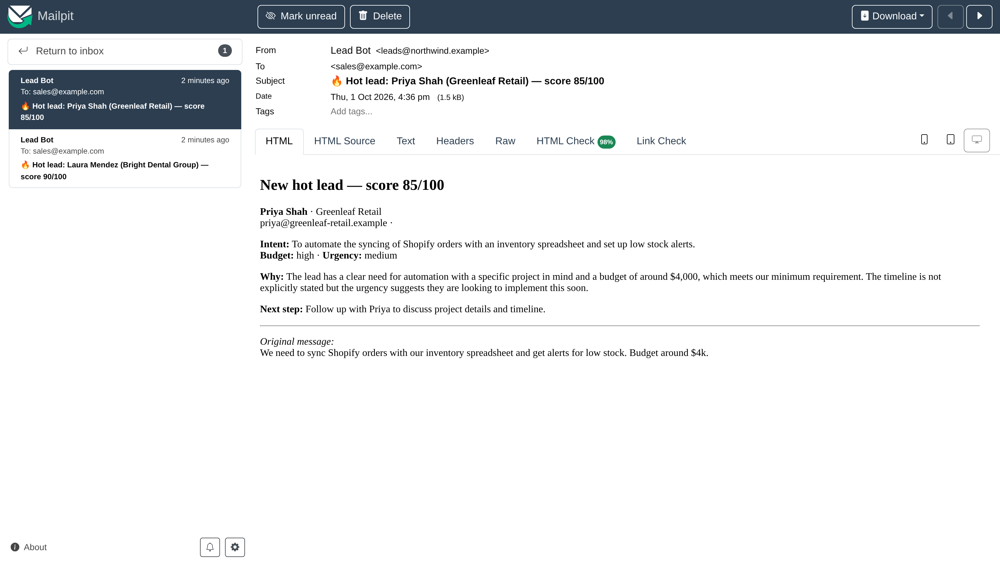
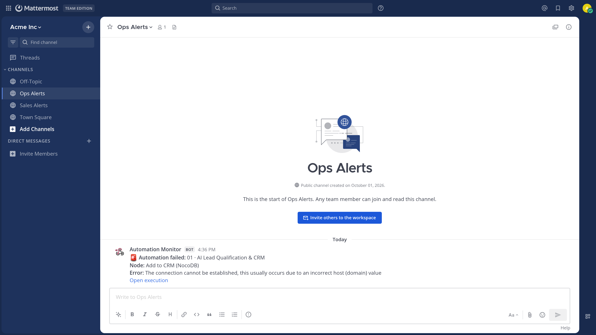

# AI Lead Qualification & CRM Automation

> A lead submits a form. n8n receives it, sends it to an LLM, scores and categorizes the lead, stores it in a database, and notifies the sales team — in about 3 seconds.

**Stack:** n8n · OpenAI API · Webhooks · REST APIs · PostgreSQL · NocoDB (CRM) · Mattermost (Slack-compatible) · Email (SMTP) · Docker



| Hot lead alert (Mattermost / Slack) | CRM updated automatically (NocoDB) |
|---|---|
|  |  |
| **Email to the sales rep** | **Failure alert with link to the execution** |
|  |  |

## The business problem

Sales teams waste hours reading every form submission, and the best leads wait in the same queue as spam and students. Slow response time is one of the main reasons inbound leads go cold.

## What it automates

1. **Receives** every form submission through a secured webhook.
2. **Qualifies** it with AI against the company's ideal customer profile: score 0-100, intent, budget signal, urgency, spam detection and a recommended next step.
3. **Decides** with deterministic business rules (thresholds configurable without touching the prompt).
4. **Stores** the lead in PostgreSQL and creates it in the CRM with the right stage.
5. **Notifies** sales instantly for hot leads (chat + email) and ops for anything that needs a human.

| Score | Category | What happens |
|---|---|---|
| ≥ 75 | Hot | Chat alert in `#sales-alerts` + email to the sales rep + CRM stage **Contact now** |
| 45-74 | Warm | CRM stage **Qualify** |
| < 45 | Cold | CRM stage **Nurture** |
| — | Spam | Stored for audit only |
| — | AI unavailable / invalid output | CRM stage **Manual review** + `#ops-alerts` |

## Architecture

See [docs/architecture.md](docs/architecture.md) for the full diagram and step-by-step data flow.

```
Form → Webhook → Validation → Dedup → OpenAI (JSON schema) → Business rules → PostgreSQL → 201 response
                                                                                         → CRM / Chat / Email
```

## Reliability & security

| Concern | How it's handled |
|---|---|
| Unauthorized calls | Shared secret in `X-Webhook-Token` header → `401` |
| Bad input | Required fields, email format, length limits → `400` with field-level errors, **before** any AI cost |
| Duplicate submissions | Idempotency by email (plus a DB unique constraint) → `200 duplicate`, no second AI call |
| Unpredictable AI output | OpenAI Structured Outputs (strict JSON schema) + server-side validation of every field |
| Prompt injection | Lead text is passed as data, the system prompt instructs the model to ignore embedded instructions, and routing is decided by code, not by the model |
| OpenAI outage / rate limit | 3 retries with backoff; if it still fails the lead is **saved anyway** and sent to manual review |
| CRM / chat / email outage | 3 retries per integration; then the global error workflow stores the failure and alerts `#ops-alerts` with a link to the execution |
| Observability | `execution_log` table: status, latency, model and token usage per request |
| Secrets | Only in `.env` / n8n encrypted credentials — no keys in the workflow JSON |

## Run it locally

Requirements: Docker + Docker Compose, an OpenAI API key.

```bash
cp .env.example .env              # add your OPENAI_API_KEY
./scripts/bootstrap.sh            # starts everything and configures n8n, CRM and chat
./01-ai-lead-qualification/scripts/demo.sh --reset
```

Send a single lead:

```bash
curl -X POST http://localhost:5678/webhook/lead-intake \
  -H "X-Webhook-Token: $WEBHOOK_TOKEN" -H "Content-Type: application/json" \
  -d @01-ai-lead-qualification/samples/01-hot-lead.json
```

```json
{ "status": "accepted", "request_id": "…", "lead_id": 1, "score": 88, "category": "hot", "route": "sales_alert" }
```

### API contract

`POST /webhook/lead-intake` — header `X-Webhook-Token`

| Field | Required | Notes |
|---|---|---|
| `full_name` | yes | max 120 chars |
| `email` | yes | valid email, used for deduplication |
| `message` | yes | 10-4000 chars |
| `company`, `website`, `phone`, `budget`, `source` | no | free text |

Responses: `201 accepted` · `200 duplicate` · `400 rejected` (with `errors[]`) · `401 rejected`.

### Sample data

| File | Scenario |
|---|---|
| `samples/01-hot-lead.json` | Operations director, clear need, budget and timeline |
| `samples/02-warm-lead.json` | Real need, no budget yet |
| `samples/03-cold-lead.json` | Student, long timeline |
| `samples/04-spam.json` | SEO spam |
| `samples/05-invalid.json` | Missing/invalid fields |
| `samples/06-prompt-injection.json` | Tries to force a score of 100 |

## Adapting it for a client

- **Different CRM:** replace the `Add to CRM` HTTP node with the HubSpot, Pipedrive, Salesforce or Airtable node — the rest of the workflow does not change.
- **Slack or Teams instead of Mattermost:** set `NOTIFY_WEBHOOK_URL` to a Slack/Teams incoming webhook (same payload).
- **Different ideal customer profile:** edit the prompt in `Build AI Request`; thresholds via `HOT_LEAD_THRESHOLD` / `WARM_LEAD_THRESHOLD`.
- **Other lead sources:** Typeform, Webflow, Facebook Lead Ads or WordPress forms can post to the same webhook.

## Portfolio checklist

| Question | Answer |
|---|---|
| What business problem does it solve? | Sales wastes time triaging inbound leads and responds too slowly to the good ones. |
| What does it automate? | Validation, deduplication, AI scoring, CRM entry and routing/notification of every lead. |
| Which tools does it integrate? | Web form, n8n, OpenAI, PostgreSQL, NocoDB CRM, Mattermost/Slack, email. |
| What happens if something fails? | Invalid input is rejected with clear errors; AI failures fall back to manual review without losing the lead; integration failures are retried, logged and alerted with a link to the execution. |
| What does the client get? | Hot leads reach a salesperson in seconds, the CRM is always up to date, and nobody reads spam. |
