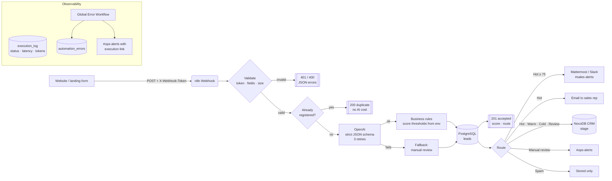

# Architecture — AI Lead Qualification & CRM Automation

## Data flow

| Step | Node(s) | What happens |
|---|---|---|
| 1 | `Lead Form Webhook` | Receives the JSON form submission. |
| 2 | `Validate & Normalize` | Checks the shared token, required fields, email format and size limits; trims and normalizes input. |
| 3 | `Find Existing Lead` / `Is Duplicate?` | Idempotency by email — repeated submissions are answered without calling the AI. |
| 4 | `Build AI Request` / `AI Qualify Lead (OpenAI)` | Prompt with the ideal customer profile; response forced to a strict JSON schema. |
| 5 | `Parse AI & Apply Rules` | Validates the AI output and maps score → category/route using thresholds from env vars. |
| 6 | `AI Fallback → Manual Review` | If OpenAI fails after 3 retries, the lead is kept and routed to a human. |
| 7 | `Save Lead (PostgreSQL)` | Single source of truth; unique constraint on email protects against race conditions. |
| 8 | `Respond Accepted` | The form receives `201` with score and route (~2-4 s). |
| 9 | `Route Lead` → notifications / CRM | Hot: Mattermost + email + CRM. Warm/Cold: CRM. Review: ops alert + CRM. Spam: nothing. |
| 10 | `Log Success` | Latency, model and token usage per request. |

## Database

- `leads` — lead data, AI qualification and final route ([schema](../../infra/postgres/init/10-lead-qualification.sql)).
- `execution_log` — one row per request: `success`, `rejected`, `duplicate` ([schema](../../infra/postgres/init/01-shared.sql)).
- `automation_errors` — failures captured by the global error workflow.
