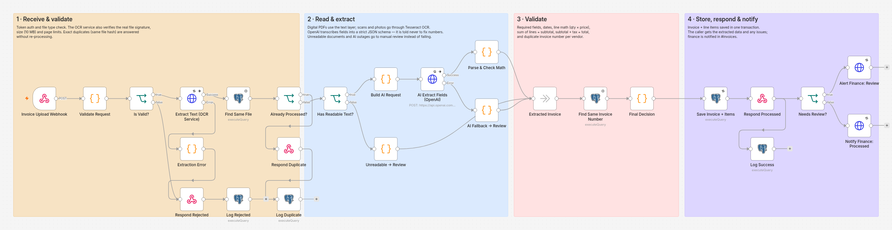
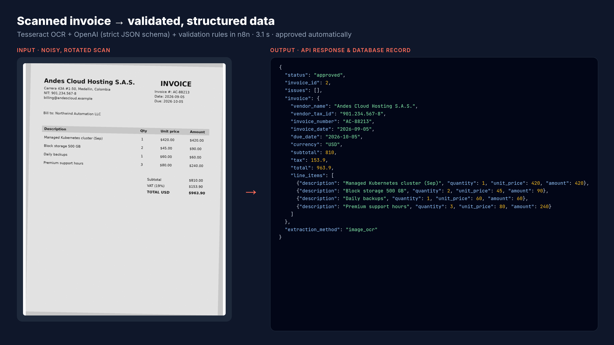
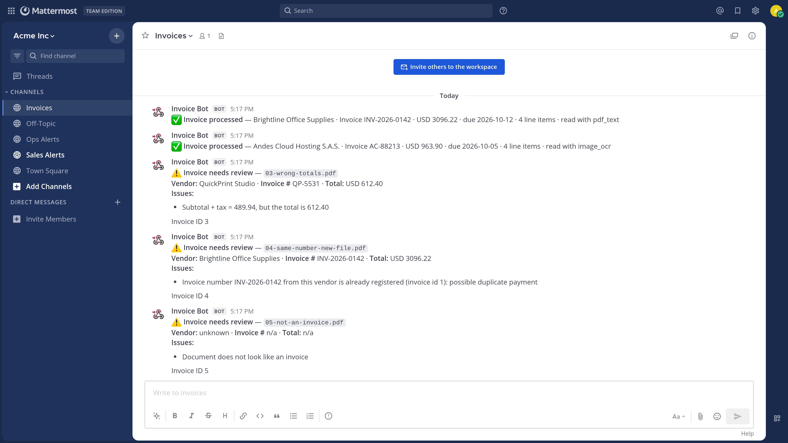

# AI Document Processing & Data Extraction

> An invoice is uploaded. The system reads it (text layer or OCR), extracts vendor, dates, totals and line items with AI, checks the math, stores it, and flags anything suspicious for human review — in about 3 seconds.

**Stack:** n8n · Python / FastAPI · Tesseract OCR · OpenAI API · PostgreSQL · REST APIs · Docker · Mattermost (Slack-compatible)



| Scanned invoice → structured data | Review alert with the reasons |
|---|---|
|  |  |

## The business problem

Accounts-payable teams type invoices by hand into spreadsheets or ERPs: vendor, number, dates, every line and total. It's slow, error-prone, and the costly mistakes — wrong totals and invoices paid twice — are exactly the ones a tired person misses.

## What it automates

1. **Receives** PDFs or photos/scans through a secured upload endpoint (connectable to an email inbox, Drive folder or portal).
2. **Reads** the document: digital PDFs through their text layer, scans and photos through OCR.
3. **Extracts** vendor, tax ID, invoice number, dates, currency, subtotal, tax, total and every line item with AI, into a strict schema.
4. **Validates** the result with deterministic rules — not with the AI.
5. **Stores** invoice + line items in PostgreSQL and **notifies** finance, with the exact reasons when something needs a human.

| Check | Example issue raised |
|---|---|
| Line math | `Line 2: 3 × 45.00 = 135.00, but the invoice says 150.00` |
| Lines vs subtotal | `Line items add up to 450.00, but the subtotal is 480.00` |
| Subtotal + tax vs total | `Subtotal + tax = 489.94, but the total is 612.40` |
| Duplicate payment | `Invoice number INV-2026-0142 from this vendor is already registered (invoice id 1)` |
| Required fields / dates | `Missing invoice number`, `Due date is before the invoice date` |
| Wrong document | `Document does not look like an invoice` |
| Unreadable scan | `Document text could not be read (0 characters extracted with image_ocr)` |

## Architecture

See [docs/architecture.md](docs/architecture.md) for the diagram, the step-by-step flow and the extractor API.

```
Upload → Webhook → Validation → Extractor (PDF text / OCR) → Dedup → OpenAI (JSON schema)
       → Validation rules → Duplicate-payment check → PostgreSQL → 201 response → #invoices
```

## Reliability & security

| Concern | How it's handled |
|---|---|
| Unauthorized calls | `X-Webhook-Token` header → `401` |
| Wrong or dangerous files | Type checked by the real file signature (not the extension), 10 MB and 10-page limits, corrupted PDFs → `422`; the OCR service runs as a non-root user |
| Same file uploaded twice | SHA-256 idempotency → `200 duplicate`, no AI cost |
| Same invoice in a new file | Vendor + invoice number check → flagged as possible duplicate payment |
| AI "fixing" numbers | Prompt forbids it; strict JSON schema; every amount re-checked in code |
| Prompt injection inside a document | Document text is passed as delimited data and the model is told to ignore instructions in it; the model never decides the status |
| Unreadable document | Stored as `needs_review` with the reason, never silently dropped |
| OCR service down | 3 retries, then `503` to the caller and a `failed` entry in the log |
| OpenAI down | 3 retries, then the document is stored as `needs_review` |
| Partial writes | Invoice and line items saved in a single SQL statement |
| Observability | `execution_log` (status, latency, tokens) + global error workflow with alerts |

## Run it locally

Requirements: Docker + Docker Compose, an OpenAI API key.

```bash
cp .env.example .env              # add your OPENAI_API_KEY
./scripts/bootstrap.sh            # builds the extractor, starts everything, imports workflows
./02-ai-document-extraction/scripts/demo.sh --reset
```

Upload a single document:

```bash
curl -X POST http://localhost:5678/webhook/invoice-intake \
  -H "X-Webhook-Token: $WEBHOOK_TOKEN" \
  -F file=@02-ai-document-extraction/samples/02-scanned-invoice.png
```

```jsonc
{
  "status": "approved",
  "invoice_id": 2,
  "issues": [],
  "invoice": {
    "vendor_name": "Andes Cloud Hosting S.A.S.", "vendor_tax_id": "901.234.567-8",
    "invoice_number": "AC-88213", "invoice_date": "2026-09-05", "due_date": "2026-10-05",
    "currency": "USD", "subtotal": 810, "tax": 153.9, "total": 963.9,
    "line_items": [{ "line_no": 1, "description": "Managed Kubernetes cluster (Sep)", "quantity": 1, "unit_price": 420, "amount": 420 } /* + 3 more */]
  },
  "extraction_method": "image_ocr"
}
```

Responses: `201` (`approved` or `needs_review` + `issues[]`) · `200 duplicate` · `400` / `401` / `413` / `415` / `422 rejected` · `503` OCR unavailable.

### Sample documents

All fictional, generated by [`samples/generate_samples.py`](samples/generate_samples.py).

| File | Scenario | Expected |
|---|---|---|
| `01-clean-invoice.pdf` | Digital PDF, 4 lines | approved |
| `02-scanned-invoice.png` | Rotated, noisy scan (OCR) | approved |
| `03-wrong-totals.pdf` | Printed total doesn't match | needs_review |
| `04-same-number-new-file.pdf` | Reissued copy of invoice 01 | needs_review (duplicate payment) |
| `05-not-an-invoice.pdf` | A lunch menu | needs_review |
| `06-unsupported.txt` | Text file | 415 |

### Tests

```bash
docker compose run --rm extractor pytest      # 8 tests: text layer, OCR, scanned PDF, file types, corrupted/empty files
```

## Adapting it for a client

- **Input:** trigger from Gmail/Outlook attachments, a Google Drive / SharePoint folder or an upload form instead of the webhook.
- **Output:** push approved invoices to QuickBooks, Xero, an ERP API or Google Sheets; send `needs_review` to Slack/Teams with an approve button.
- **Other documents:** receipts, purchase orders, delivery notes or bank statements — change the JSON schema and the validation rules.
- **Harder documents:** switch Tesseract for a cloud OCR (Google Document AI, AWS Textract, Azure) behind the same `/extract` contract.

## Portfolio checklist

| Question | Answer |
|---|---|
| What business problem does it solve? | Manual invoice data entry is slow and lets wrong totals and duplicate payments slip through. |
| What does it automate? | Reading the document, extracting every field and line, validating the math, detecting duplicates, storing and routing it. |
| Which tools does it integrate? | n8n, a Python/FastAPI OCR microservice (Tesseract), OpenAI, PostgreSQL, Mattermost/Slack. |
| What happens if something fails? | Bad files get clear 4xx errors; unreadable documents and AI outages are stored for manual review; OCR outages return 503 and are logged; every failure is retried and alerted. |
| What does the client get? | Clean, structured invoice data in seconds, with humans only looking at the invoices that actually have a problem — and why. |
