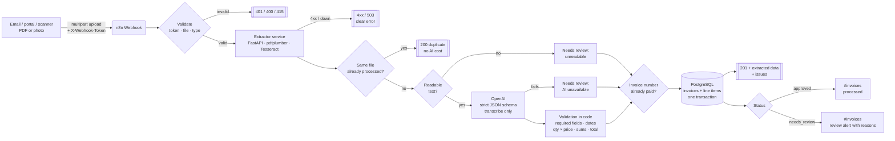

# Architecture — AI Document Processing & Data Extraction

## Why OCR + LLM, and why validate in code

- **OCR / text layer** turns any PDF or photo into text. Digital PDFs skip OCR entirely (exact and ~20 ms); scans and photos go through Tesseract.
- **The LLM only transcribes.** It is instructed never to correct numbers, and its output is forced into a strict JSON schema.
- **Code decides.** Arithmetic checks (line totals, subtotal, tax, total), required fields, date sanity and duplicate detection are deterministic, so a wrong invoice is never "auto-fixed" by the model and the reasons for review are explainable.

## Data flow

| Step | Node(s) | What happens |
|---|---|---|
| 1 | `Invoice Upload Webhook` / `Validate Request` | Token, file present, allowed type (PDF, PNG, JPEG, TIFF, WEBP). |
| 2 | `Extract Text (OCR Service)` | Calls the extractor: real file type by signature, size/page limits, text layer or OCR, SHA-256 of the file. 3 retries. |
| 3 | `Extraction Error` | 4xx from the extractor → same code to the caller; outage → `503`. Logged as `rejected` / `failed`. |
| 4 | `Find Same File` / `Already Processed?` | Idempotency by file hash — re-uploads don't cost AI tokens or create duplicates. |
| 5 | `Has Readable Text?` | Fewer than 40 characters → stored as `needs_review` (blank page, bad photo). |
| 6 | `Build AI Request` / `AI Extract Fields (OpenAI)` | Vendor, tax ID, number, dates, currency, amounts and line items as strict JSON. |
| 7 | `Parse & Check Math` | All validation rules; each problem becomes a human-readable issue. |
| 8 | `Find Same Invoice Number` / `Final Decision` | Same vendor + invoice number in a different file → possible duplicate payment. Any issue → `needs_review`. |
| 9 | `Save Invoice + Items` | Invoice and line items in a single SQL statement (all or nothing). |
| 10 | `Respond Processed` / `Log Success` | Caller receives the structured data; latency and token usage are logged. |
| 11 | `Needs Review?` → notifications | Review alert with reasons, or a short "processed" message, in `#invoices`. |

## Database

- `invoices` — header data, `status`, `issues` (JSON array), raw text and extraction method ([schema](../../infra/postgres/init/20-document-extraction.sql)).
- `invoice_items` — one row per line item.
- `execution_log` / `automation_errors` — shared observability tables.

## Extractor service API

`POST /extract` (multipart, field `file`) → `200` with `{ file_name, mime_type, size_bytes, sha256, method, pages, chars, duration_ms, text }`

| Code | When |
|---|---|
| 400 | Empty file |
| 413 | Larger than `MAX_FILE_MB` (10) or more than `MAX_PAGES` (10) pages |
| 415 | Not a PDF or image (detected by file signature, not by extension) |
| 422 | Corrupted or unreadable PDF |

`GET /health` — liveness and Tesseract version. Unit tests: `docker compose run --rm extractor pytest`.
