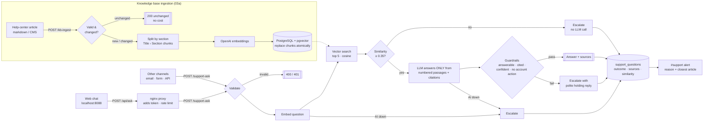

# Architecture — AI Customer Support & Knowledge Base (RAG)

## How "no hallucinations" is enforced

The model is never the only safety net. Four independent layers decide whether an answer is sent:

| Layer | Where | What it does |
|---|---|---|
| Retrieval threshold | `Select Context` | If no passage reaches the similarity threshold (`RAG_MIN_SIMILARITY`, default 0.35) the question is escalated **without calling the LLM**. |
| Grounded prompt | `Build Grounded Prompt` | The LLM receives numbered passages and must answer only from them, cite them, and say so when it can't answer. |
| Structured output | `Generate Answer (OpenAI)` | Strict JSON schema: `answerable`, `needs_human`, `answer`, `cited_passages`, `confidence`. |
| Guardrails in code | `Apply Guardrails` | Escalates when not answerable, when no valid passage is cited, when confidence is low, or when the customer asks for an account/money action (refunds, disputes, deletions, security incidents). |

## Web chat

`chat/index.html` is a single static page (no build step, no external dependencies) served by nginx (`chat/nginx.conf.template`, service `support-chat` in `docker-compose.yml`).

- **Token stays on the server:** the page posts to `/api/ask`; nginx forwards it to the `support-ask` webhook and adds the `X-Webhook-Token` header. The browser never sees the token.
- **Abuse limits:** only `POST` on `/api/ask`, 8 KB max body, 20 questions per minute per IP (`429` above that).
- **Cited sources:** each source chip opens the exact section of the article the answer used. nginx serves `knowledge-base/` read-only at `/kb/`, and the page cuts out the section with the same `##`/`###` rule the ingestion workflow uses.
- **Escalations** show the ticket number; the internal escalation reason is only sent to the team channel, never to the customer.

## Ingestion details

- **Chunking** by `##` sections, so each chunk is a self-contained topic; long sections are split on paragraph boundaries (~1,500 characters). Each chunk is prefixed with `Article title › Section`, which improves retrieval and gives readable citations.
- **Idempotent**: the SHA-256 of the article is compared with the stored one; unchanged articles cost nothing.
- **Atomic replace**: the document upsert, the deletion of old chunks and the insertion of new chunks run in one SQL statement, so a search never sees a half-updated article. If embedding fails, the previous version stays indexed.
- **Index**: HNSW on `vector_cosine_ops` (pgvector) — fast approximate search that scales to hundreds of thousands of chunks.

## Data flow (support assistant)

| Step | Node(s) | What happens |
|---|---|---|
| 1 | `Support Question Webhook` / `Validate Question` | Token, question 5-1000 characters, optional customer email and channel. |
| 2 | `Embed Question (OpenAI)` | `text-embedding-3-small`, 3 retries. |
| 3 | `Search Knowledge Base (pgvector)` | Top 5 chunks by cosine distance with their similarity score. |
| 4 | `Select Context` / `Has Relevant Docs?` | Keeps chunks above the threshold; none → escalate. |
| 5 | `Build Grounded Prompt` / `Generate Answer (OpenAI)` | Answer in the customer's language, max ~120 words, with citations. |
| 6 | `Apply Guardrails` | Final decision: `answered` or `escalated` + reason. |
| 7 | `Save Question` / `Respond to Customer` / `Log Success` | Stored with sources and similarity; the customer gets the answer or a holding message and a ticket id. |
| 8 | `Escalated?` → `Alert Support Team` | `#support` gets the question, the reason and the closest article. |

## Database

- `kb_documents`, `kb_chunks` (with `vector(1536)` embeddings) — the searchable knowledge base ([schema](../../infra/postgres/init/30-support-knowledge-base.sql)).
- `support_questions` — every question, outcome, escalation reason, sources and top similarity: the raw material to find gaps in the help center.
- `execution_log` / `automation_errors` — shared observability tables.
